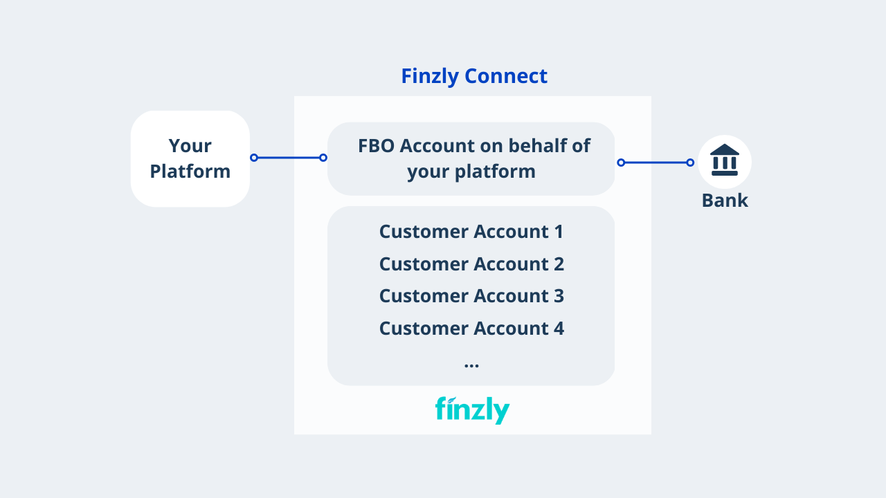

## **Accounts**

### **Direct Deposit Accounts**

Finzly Connect APIs allow platform providers to create direct deposit accounts with banks to help them carry out payment transactions on behalf of their customers.

Many platform providers prefer to set up their accounts as FBO accounts or For Benefit Of accounts. These accounts are held in the name of a beneficiary and can manage children entities which are in turn set up as virtual accounts. Money movement can be simplified for fintechs and platform providers who hold a master account (the FBO) with the bank. 

### **Customer setup using Virtual Accounts:**

Finzly Connect supports the creation and setting up of customer relationships using virtual accounts. Virtual accounts serve as subledgers allowing downstream setup associations to an existing deposit account. Platform providers can use these accounts to set up their customers or downstream partners, in turn, moving money in and out of these virtual accounts without latency and manual reconciliation. The Finzly Connect API allows virtual accounts to be assigned to consumers, suppliers, locations, or any other entity that needs tracking at an atomic level. 

Virtual accounts replace the need to create many individual bank accounts, while providing platform providers the ability to reconcile money movement at a granular level. Businesses and platform providers can bypass the need to manually manage client money, giving the flexibility to aggregate and segregate client money with up-to-date visibility of funds.

The flexible virtual account setup through Ledger-as-a-service can be used for client money management for Asset management, Pension Funds, Real estate, Digital wallets, Virtual cash management (POBO, COBO) and many more use cases.

### **Ledger-as-a-service model**

<!-- ## **ACH Payment** -->

### **Key features**
- Ability to set up customers on CRM using virtual accounts
- Supports different customer types – consumer, corporate, downstream partners and third parties
- Ability to get all accounts associated with a customer using a single call
- Bespoke configuration of non-STP criteria through customizable workflows
- Number of real accounts are rationalized
- Intuitive UI, customizable dashboards and alerts
- Provide the most updated account details of customers in real-time
- Ability to search, retrieve and update customers 
- Automated reconciliation and error handling

### **Use case in action**
- An investment management company wants to manage its customers using different pension funds by associating them to different parent virtual accounts that correspond to each pension fund.
- By segregating the funds of customers using virtual accounts, the company can hold funds on behalf of customers
- The investment management company can easily attribute incoming and outgoing payments to the right pension fund and the virtual accounts of their customers under that parent pension account
- Cost-effective solution for managing client accounts
- The company benefits from reduced administrative costs and simplified reconciliation