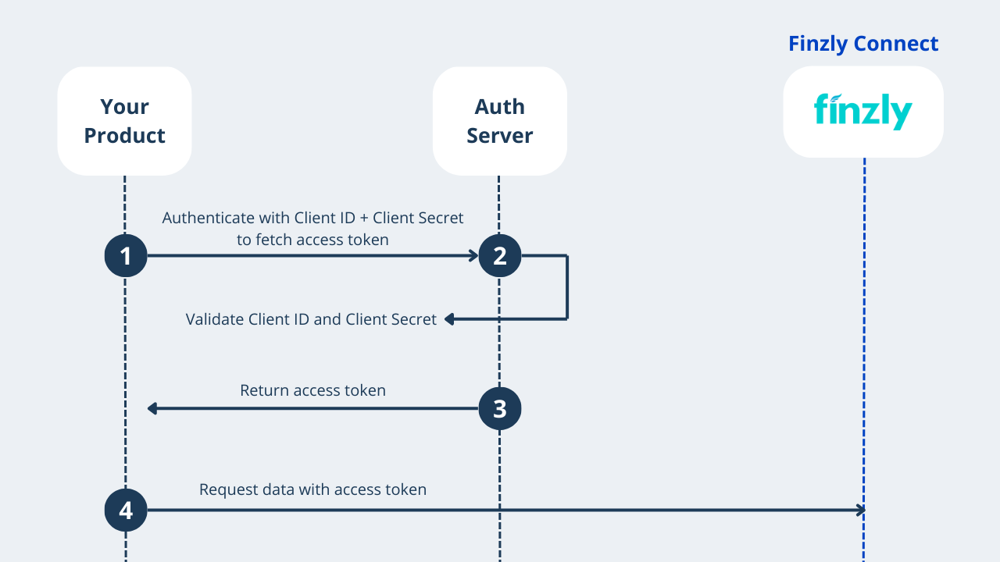

## **Authentication**
Our APIs use oAuth 2.0 authentication protocol to provide secure access. You will use our API keys with grant type “Client Credentials” to fetch an access token. This token is digitally signed and contains access information such as user role mapping etc. Access token is a short-lived token (30 sec). To authenticate and authorize your API calls, you will have to pass the access token in authorization header with “bearer” prefix. 




**Sample Request**
```yaml Before 

curl -X POST [URL] 
-H "Content-Type: application/x-www-form-urlencoded" 
-H 'Authorization: Basic [Base64(apikey:apisecert)]' 
-d 'grant_type=client_credentials'

```

**Sample Response**

```yaml Before 
{
 "access_token": "",
 "expires_in": 14400,
 "refresh_expires_in": 1800,
 "refresh_token":"",
 "token_type": "bearer",
}

```