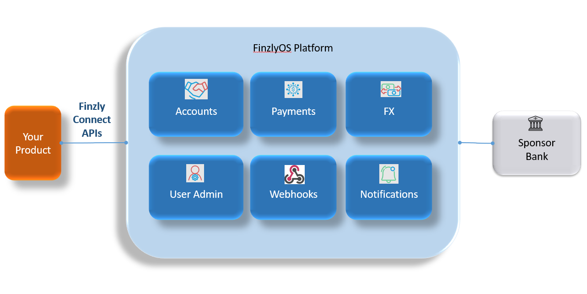

## **Introduction to Finzly Connect API**
Finzly Connect is a universal API designed to serve as the conduit between platforms/developers and banks that have Finzly’s modern payment infrastructure. Using this universal API, banks, fintechs, platforms and enterprises can access all the payment rails without stressing over the network and messaging rules. Additionally, other banking services like managing accounts, FX and administrative features can also be used. 

Finzly Connect runs on a real-time platform, FinzlyOS, that is connected to several US banks and offers a comprehensive repository of banking microservices that can be used to build platforms using APIs. Our products are delivered through a single API integration that can help you connect to a bank of your choice that is on the Finzly network.

Finzly Connect offers REST API and webhook notifications to access any Finzly-powered bank. Finzly has standardized the payment data and made the payment processing super simple, so a bank customer, whether a fintech, business or an individual, doesn't have to focus about the payment messaging rules, but just about their product innovation. Developers can access ACH, Domestic Wires, International Wires, RTP, and FedNow using Finzly Connect and process the payments through their favorite Finzly Bank.

Platforms benefit from a head start to accelerate their innovation as:
- You can manage the money movement of your customers using a single API across multiple payment types.
- All our products are interoperable – accounts, payments, customer management, giving them greater agility to combine the building blocks to build innovative products.
- Finzly Connect API runs on a real-time, cloud-native platform that provides scalability to suit your growth needs.
- Smart routing of payments gives you access to the most cost-effective rail based on the urgency of the payments – ACH, Fedwire, RTP, FedNow and SWIFT.

<!--  -->

<!-- 

<strong>

### Payment Solutions</strong>

____

 -->

