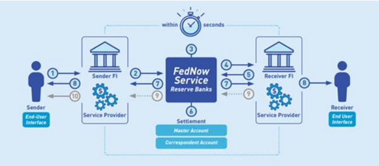

## **Instant Payment**

While ACH is used for high volume or low value payments, and FEDWIRE is used for faster or high value payments, the new instant payment networks such as RTP and FEDNOW are emerging to enable instant payments that are processed in real-time within seconds and are irrevocable. It is important to note that Debit cards enable instant payments, those transactions are comparatively expensive than RTP or FEDNOW payments and requires a debit card in addition to the bank account. Finzly offers instant payments from a bank account to another bank account via either RTP or FEDNOW, based on the sender and receiver bank’s connectivity. 

While there are other payment networks such as Zelle, Venmo, Cash App enable real-time settlement of funds at user’s accounts, these payment rails operate on top of other clearing networks such as ACH, RTP, FEDNOW or Card networks. 

The following diagram explains the fund flow in FedNow and RTP payment network.

Finzly Connect offers instant payment access and notifications via simple REST API. Develop new financial products such as Point of Sale, QR based invoices, and get paid instantly from your customer’s bank and eliminate card transaction fees.
