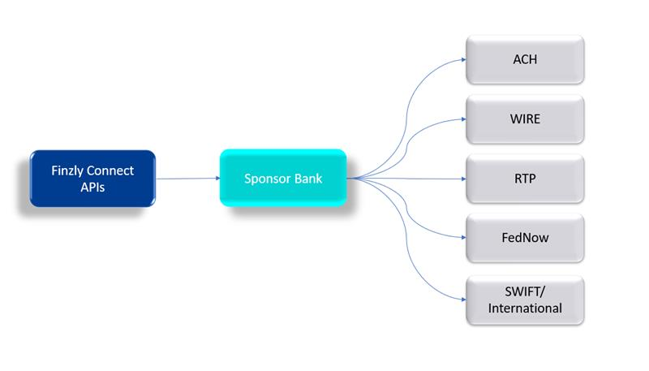

## **Overview**

Finzly Connect is the universal payment API for the developers to access all the payment rails, without
having to worry about the network and messaging rules. Finzly Connects offers REST API and webhook
notifications to access any Finzly powered bank. Finzly has normalized the payment data and has made
the payment processing super simple, so a bank customer, whether it is a fintech, business or an
individual, doesn’t have to worry about the messaging rules. A developer can access ACH, Domestic
Wires, International Wires, RTP and FedNow using Finzly Connect, and connect to their favorite Finzly
Bank.

## **Payment Network**


Finzly connect APIs are designed with the mindset that it should be simple to understand and easy to
integrate. Hence, we have exposed one API to initiate a payment for multiple rails such as ACH, WIRE,
RTP, FedNow, etc.
The payment API is powered by the payment routing engine (rule-based workflow) to make it simple to
understand. The consumer does not have to choose or decide the payment rail or network (such as ACH,
RTP FedNow, etc.) to create a payment instead they have to choose from the simple options based on the
payment speed and cost, for instance, "Economy" for less cost and 2 to 3 business days to transfer the
money or "Instant” for little higher cost and instant money transfer.

## **Features and Benefits**
1. API supports both domestic as well as international payments using One API
2. Payment Scheduling - It allows user to schedule a payment to the future date
3. Repetitive Payments - It provides various options to set the repetitive payments such as Daily,
Weekly, Bi-Weekly, Monthly etc. 


To initiate a payment, the developer must provide very minimal details as follows
1. Sender Account
    1. Sender Unique ID
2. Receiver Information
    1. Receiver Unique ID
3. Amount
4. Currency
5. Speed – Economy or Economy Plus or Express or Instant
6. Notes – Payment Notes

Based on the speed, Finzly’s payment hub would process the payment using the most cost-efficient
payment option available. The following lines of code would initiate a payment request successfully

```yaml Before
{
curl -X POST [URL]
-H "Content-Type: application/json"
-H "Authorization: bearer [ACCESS TOKEN]"
-d '{"externalReferenceId": "refid-128976","paymentCurrency": "USD","paymentAmount":
100.00,"speed": "Economy","paymentNotes": "Payment for the invoice #123","sender":
{"accountUID": "123452334"},"receiver": {"accountUID": "12334989"}}'
}

```
Developers can receive real-time webhook notifications for
1. Outgoing credit payment statuses
2. Outgoing debit payment statuses
3. Incoming payments
4. Incoming drawdowns
5. Incoming debit requests
6. Incoming returns
7. Incoming NOCs
8. Incoming RFPs