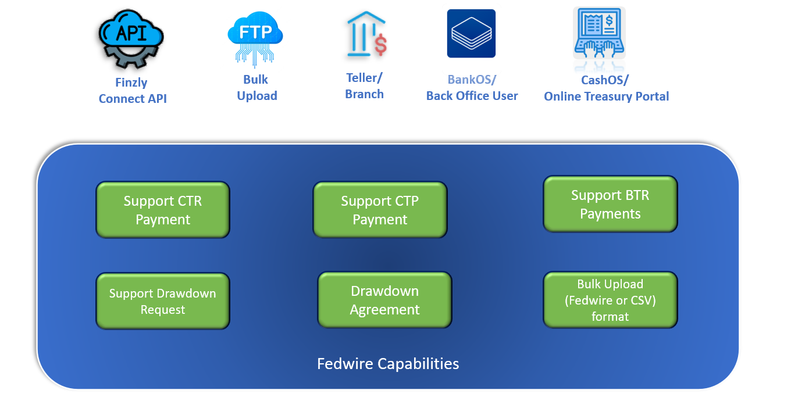

## **Wire Transactions**
<!--

  
-->

### **Business Function Codes**

Finzly Connect APIs support following business function codes for the Fedwire payments.

|**Business Function Codes**|**Description**|
| :- | :-: |
| CTR | Customer or Corporate Credit Transfer (Where Beneficiary is a Customer - Consumer/Corporate)|
| CTP | Customer Transfer Plus (Where Beneficiary is a Customer - Consumer /Corporate with Additional remittance information) |
| DRC | Customer or Corporate Drawdown Request|
| DRW | Drawdown Payment |

### **Payment Status Updates**
- Payment Status Notification for every event on the wire life cycle will be notified. This will be applied for both outgoing and incoming payments.
- Validation Failed - Fedwire Payment with the Exception status will be notified.
- OFAC Review/Reject - Fedwire Payment with OFAC compliance Exception will be notified.
- Memo Post Status - Fedwire Payment with memo post status failure will be notified.
- Processed - Notification back to the Customer on payment Processing.

### **Drawdown Initiation**
- Drawdown initiation is possible for customer using the open Banking API  
- Every Drawdown request initiated will be received as a separate drawdown payment linking the original payment.

### **Notifications**

Fedwire incoming payment notification will be triggered with a source of webhook notification. Customers can configure to receive these notifications. Additionally, they can configure an Inbound FTP account to receive the actual raw messages. All the inbound wires can be transmitted with a raw wire file message file received from Fed through the FTP source.

### **Cut-off times**

The Fedwire Funds Service business day begins at 9:00 A.M. (EST) on the calendar day and ends at 7:00 P.M. (EST), Monday through Friday, excluding designated holidays. However, wire payments can be scheduled anytime and it will be processed at the scheduled date.
